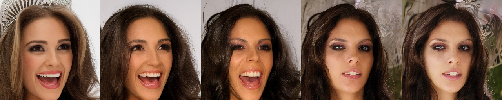

# Image starting noise reconstruction for Deep Denoising Implicit Model(DDIM)

This repo contains PyTorch implementation of DDIM inversion algorithm from [DiffusionCLIP](https://arxiv.org/abs/2110.02711).

Based on [latent-diffusion](https://github.com/CompVis/latent-diffusion) models. 

## Usage
Install dependencies.

Download pretrained `latent-diffusion` weights with `download_models.sh` script.

For more information read [ddim_inversion.ipynb](./ddim_inversion.ipynb) notebook.